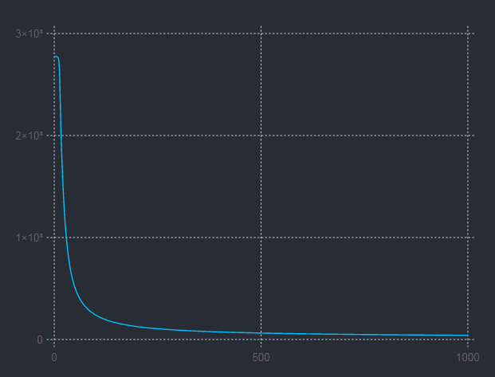

# AutoDiffer
**此项目仍在开发中...**

这个项目实现了一些基础操作的反向梯度计算方法，借助这些基础的操作，我们可以搭建任意复杂的神经网络模型，用户只要定义好前向传播、训练准则、损失函数，就可以轻松训练自己的网络。

## 示例代码一
测试 ReLU 激活函数
```julia
m = [ 1. -2.;
     -3.  4.;
      5. -6.]

# 包裹变量
x = Variable(m)

# 对变量进行激活操作
y = relu(x)

# 手动指定损失值对输出变量的梯度
y.delta = [-0.1 0.2;
            0.3 0.4;
            0.5 0.6]

# 依据dL/dy进行反向传播
backward()
print(x.delta)
#[-0.1 0.0;
#  0.0 0.4;
#  0.5 0.0]
```

## 示例代码二
使用搭建好的一个多层感知机（多层前馈全连接网络）

```julia
input = ...
label = ...

topology = [2, 128, 2]
operator = [relu, softmax]
mlpmodel = MLP(topology, operator)
params   = paramsof(mlpmodel)

for i=1:epoch
    outs = forward(mlpmodel, Variable(input))
    COST = crossEntropyLoss(outs, Variable(label))
    backward()
    update(params, learnRate)
    zerograds(params)
    println("loss: ", COST.value)
end
```


## 变量 Variable 说明
变量用来存储计算图的节点，变量主要有如下属性
```julia
value      # 节点的前向计算结果
delta      # 损失对此节点的梯度
trainable  # 此节点是否是网络需要训练的参数
```

## 技术基础
+ 微分公式
+ 链式法则
+ 闭包函数
+ 有向无环图 DAG

## 目前可微分的基本操作
+ 矩阵与常数相加、相乘（数乘、数加）c .+ A,  c .* A
+ 矩阵按对应位置元素相加、相乘（点加、点乘）A .+ B,  A .* B
+ 矩阵按列与列向量相加、相乘 A .+ Vec, A .* Vec
+ 矩阵相乘 A * B
+ 矩阵拼接 vcat [A; B]
+ tan/tand/tanh + sin/sinc/sind/sinpi + log/log2/log10 + exp/exp2/exp10 + cos + swish + relu + leakyrelu + sigmoid + softmax + sqrt + inv
+ crossEntropy + mse + binaryCrossEntropy

## TODOoo List
+ 基础网络架构 RNN + LSTM + IndRNN
+ batchNorm
+ 卷积操作
+ GPU上的操作

## 参考
+ https://evcu.github.io/ml/autograd/
+ https://github.com/Andy-P/RecurrentNN.jl

## 声明
此项目以帮助别人学习自动微分技术为目的
